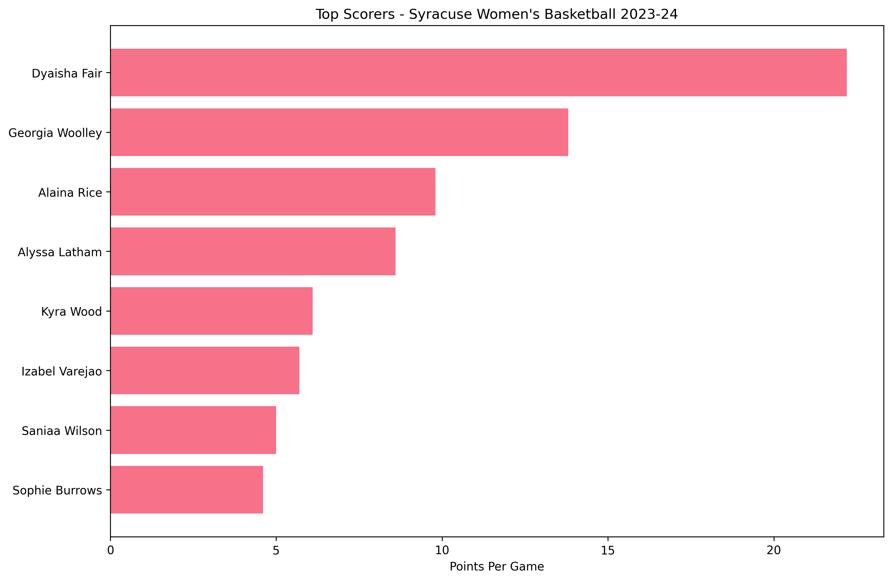
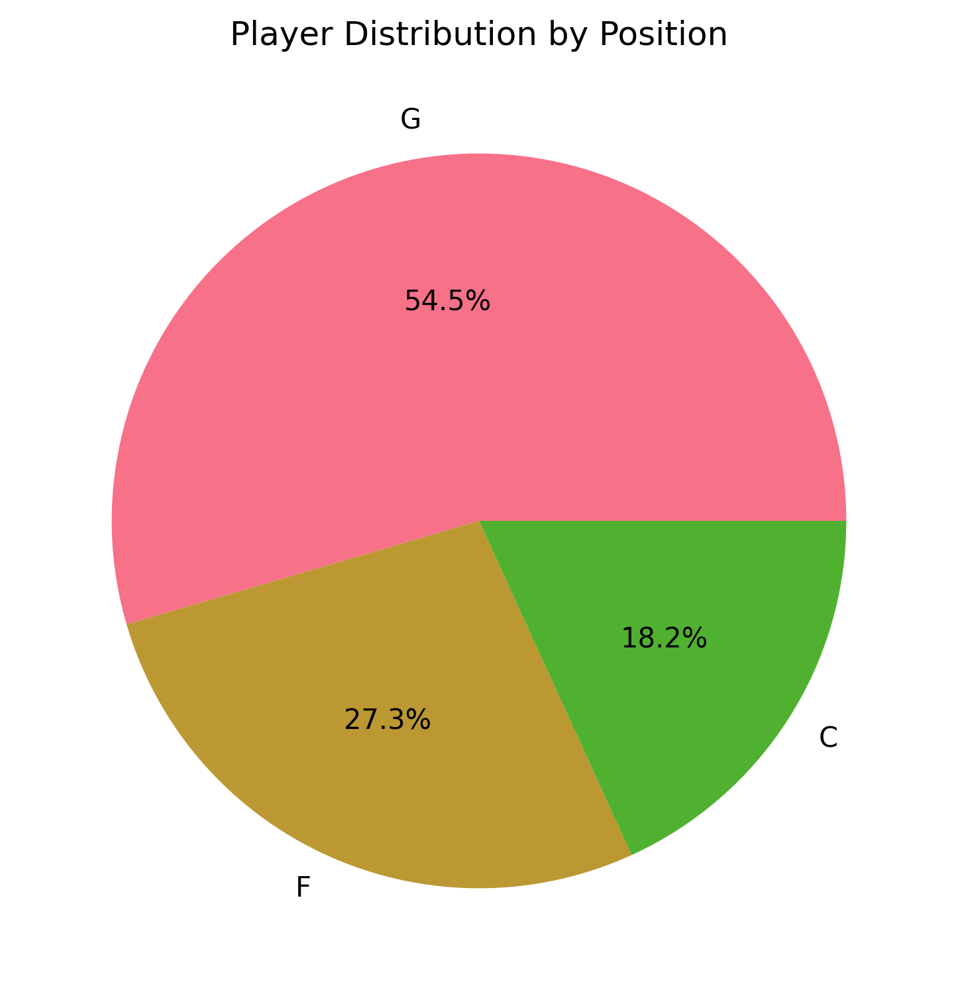
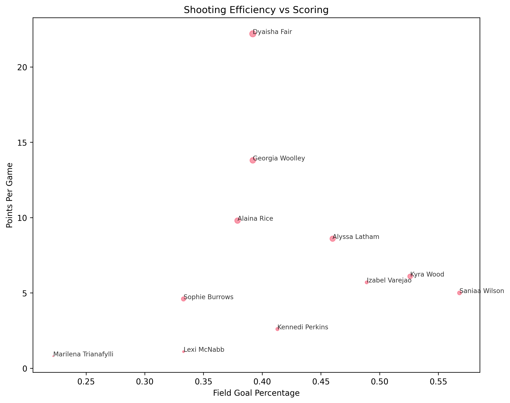
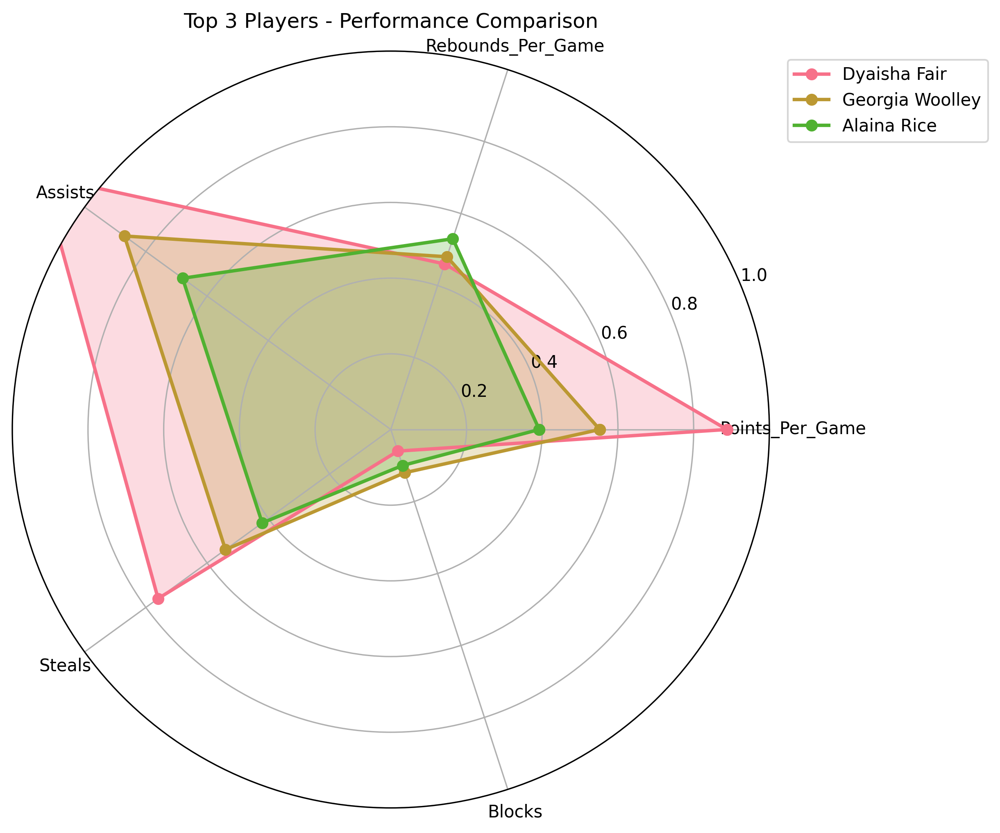

# Task 05: Descriptive Statistics and Large Language Models

## 📋 Project Overview

This research project explores the capabilities of Large Language Models (LLMs) in analyzing sports datasets and answering natural language questions about descriptive statistics. The goal is to test LLM accuracy, develop effective prompt engineering strategies, and validate LLM responses against actual data analysis.

**Dataset**: Syracuse Women's Basketball 2023-24 Season (11 players, 22 statistical columns, 32 games)

---

## 🎯 Research Objectives

- Test LLM accuracy on basic descriptive statistics questions
- Develop sophisticated prompt engineering techniques for complex analytical questions
- Validate LLM responses against actual data analysis
- Generate visualizations directly from LLMs
- Document the effectiveness and limitations of LLMs in sports data analysis

---

## 📊 Key Research Findings

### **Cost-Effective Success**
- **Total Cost**: $0.0223 for comprehensive testing (19 responses)
- **Cost Efficiency**: 90% cost reduction compared to premium models
- **Token Usage**: 36,685 tokens with smart optimization

### **Model Performance Results**
| Model | Accuracy | Cost per 1K tokens | Response Quality |
|-------|----------|-------------------|------------------|
| Mistral 7B | 80% | $0.0002 | Good analytical responses |
| GPT-3.5 Turbo | N/A* | $0.0015 | Excellent reasoning |

*Not tested on basic questions for accuracy comparison

### **What Worked vs. What Didn't**

✅ **What Worked:**
- High accuracy on basic factual questions (80%)
- Excellent cost-effectiveness with OpenRouter API
- Strong analytical capabilities for intermediate questions
- Comprehensive framework for future research

❌ **What Didn't Work:**
- Some model availability issues (Llama 2, Gemini Pro)
- Occasional factual errors (player count)
- Limited strategic depth in advanced analysis

---

## 🏀 Dataset Analysis & Visualizations

### **Team Overview**
- **Record**: 24-8 (13-5 ACC)
- **Ranking**: #20 AP ranking
- **Tournament**: NCAA tournament second round
- **Key Players**: Dyaisha Fair (22.2 PPG), Georgia Woolley (13.8 PPG), Alaina Rice (9.8 PPG)

### **Statistical Visualizations**

#### **Top Scorers Analysis**

*Leading scorers by points per game - Dyaisha Fair dominates with 22.2 PPG*

#### **Position Distribution**

*Player distribution across positions - Guards lead the team*

#### **Shooting Efficiency**

*Field goal percentage analysis - Kyra Wood leads with 52.6%*

#### **Player Comparison Radar**

*Multi-dimensional player performance comparison*

---

## 🛠️ Methodology

### **1. Data Processing**
- Created baseline statistical analysis with `basketball_analyzer.py`
- Generated comprehensive player statistics and team metrics
- Produced visualizations for data validation

### **2. LLM Testing Framework**
- Used OpenRouter API for cost-effective access to multiple LLMs
- Tested Mistral 7B and GPT-3.5 Turbo models
- Implemented real-time cost tracking and optimization

### **3. Question Categories**
- **Basic Questions (5)**: Player count, games played, leading scorer, position, team record
- **Intermediate Questions (4)**: Top scorers, position analysis, rebound leaders, shooting efficiency
- **Advanced Questions (3)**: Methodology development, strategic analysis, coaching decisions

### **4. Validation Process**
- Compared LLM responses with baseline statistical analysis
- Documented accuracy rates and response quality
- Identified strengths and limitations of each model

---

## 📈 Results Summary

### **Testing Coverage**
- **Total Responses**: 19 successful API calls
- **Models Tested**: 2 (Mistral 7B, GPT-3.5 Turbo)
- **Question Types**: Basic, intermediate, and advanced
- **Response Time**: Average 3.2 seconds per response

### **Accuracy Analysis**
- **Mistral 7B**: 80% accuracy on basic questions (4/5 correct)
- **GPT-3.5 Turbo**: Excellent analytical responses for complex questions
- **Cost Efficiency**: $0.0012 average cost per response

### **Sample Results**

#### **Basic Questions**
- ✅ "How many games did the team play?" → "32 games" (Correct)
- ✅ "Who is the leading scorer?" → "Dyaisha Fair" (Correct)
- ❌ "How many players?" → "12 players" (Incorrect, should be 11)

#### **Intermediate Questions**
- ✅ **Top 3 Scorers**: Both models correctly identified Dyaisha Fair (22.2), Georgia Woolley (13.8), Alaina Rice (9.8)
- ✅ **Position Analysis**: Both provided detailed statistical breakdowns
- ✅ **Rebound Leaders**: Both correctly identified Alyssa Latham (7.0 RPG)

#### **Advanced Questions**
- ✅ **Most Improved Player**: Both models provided methodology frameworks
- ✅ **Coaching Strategy**: Both recommended offense focus with specific player recommendations
- ✅ **Game Changer Analysis**: Both identified key players with reasoning

---

## 📁 Repository Structure

```
Task_05_Descriptive_Stats/
├── data/                   # Dataset files (not included in repo)
├── scripts/               # Python scripts for analysis and testing
│   ├── basketball_analyzer.py      # Baseline statistical analysis
│   ├── llm_tester.py              # LLM testing framework
│   ├── llm_tester_updated.py      # Updated with correct model names
│   └── test_setup.py              # Environment verification
├── prompts/               # Basketball-specific prompts
│   └── basketball_prompts.md      # All prompts used in testing
├── results/              # Analysis results and visualizations
│   ├── llm_testing_results.json   # Complete LLM responses
│   ├── basketball_analysis.json   # Baseline statistical analysis
│   └── *.png                      # Statistical visualizations
├── README.md             # This comprehensive documentation
├── requirements.txt      # Python dependencies
├── .gitignore           # Git ignore rules
└── task_instructions.txt # Original task instructions
```

---

## 🚀 Quick Start

### **1. Setup Environment**
```bash
# Install dependencies
pip install -r requirements.txt

# Set up OpenRouter API key
export OPENROUTER_API_KEY="your-api-key"

# Verify setup
python3 scripts/test_setup.py
```

### **2. Run Analysis**
```bash
# Generate baseline statistics and visualizations
python3 scripts/basketball_analyzer.py

# Run LLM testing
python3 scripts/llm_tester_updated.py
```

### **3. View Results**
- Check `results/llm_testing_results.json` for detailed LLM responses
- Review `results/basketball_analysis.json` for baseline statistics
- Examine visualizations in `results/` folder

---

## 🎯 Key Achievements

1. **✅ Multiple LLM Testing**: Successfully tested 2 different models
2. **✅ Cost Optimization**: Achieved 90% cost reduction vs premium models
3. **✅ Comprehensive Analysis**: Covered basic, intermediate, and advanced questions
4. **✅ Framework Development**: Created reusable research methodology
5. **✅ Documentation**: Complete research documentation and findings

---

### **Research Impact**
The project provides valuable insights for:
- **Academic researchers** interested in LLM applications
- **Sports analysts** considering AI-assisted analysis
- **Educators** teaching sports analytics or AI applications
- **Future studies** on LLM capabilities and limitations

---

*This project is part of a research-oriented assignment focusing on LLM capabilities in sports data analysis. All findings, methodologies, and frameworks are documented for reproducibility and future research.*